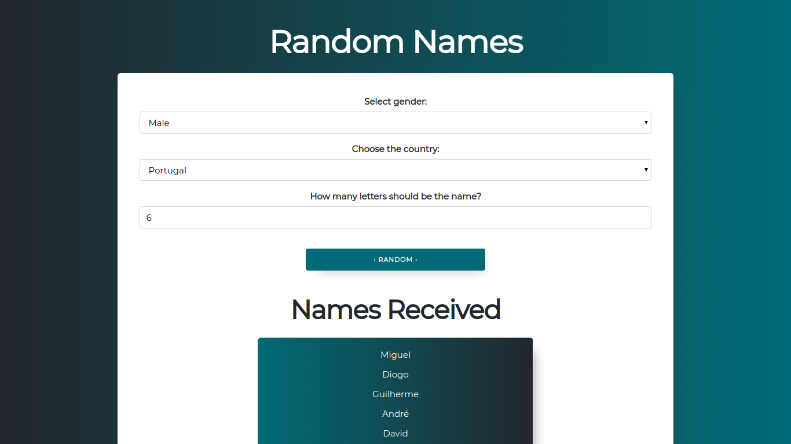

<p align="center">
  <a href="https://github.com/mazurdev/random-names">
    
  </a>
  <h1 align="center">RANDOM NAMES</h1>
  <p align="center">Mini service for generating random names</p>
  <p align="center">
   <a href="https://twitter.com/mazurdev"></a>
  </p>
  <br>
</p>

<sub>Check out my [blog-portfolio](https://mazurdev.com/)</sub>

## INTRO



## :wrench: STACK

* JavaScript
* Normalize
* Skeleton

## :heavy_check_mark: GETTING STARTED
```bash
git clone https://github.com/mazurdev/random-names.git
cd to folder
open "index.html" in your browser
```
